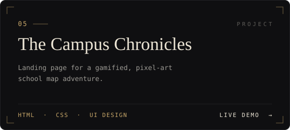
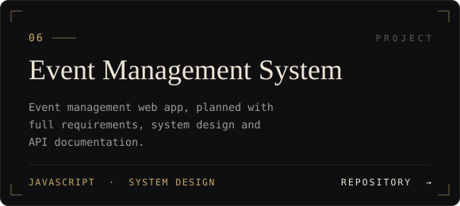
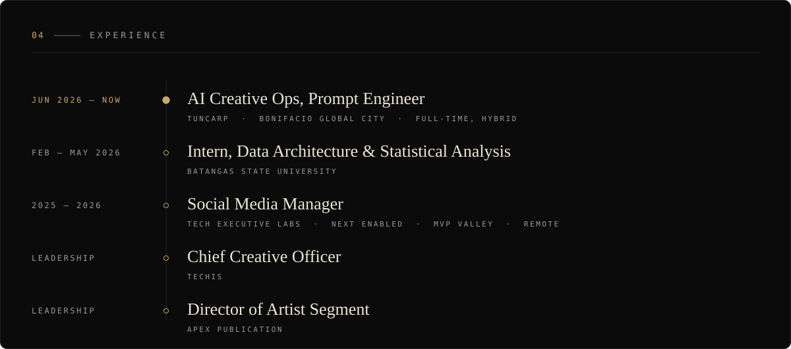

  

  
  
  
  
  

  

 

I'm **Yajie**, a Creative Technologist in Manila. I find the pattern hiding in messy data, build AI that puts it to work, and design something clear enough that anyone can act on it.

I'm currently an **AI Creative Ops Prompt Engineer at Tuncarp** in Bonifacio Global City, and a **Cum Laude graduate in Information Technology**, majoring in Business Analytics, from Batangas State University. My work moves between **AI and prompt engineering, machine learning, data science, UI/UX and web development**, with graphic design, video editing and graphite portraiture on the side.

 

  

  
  

  
  

  
  

 

  

  

  <picture>
    <source media="(prefers-color-scheme: dark)" srcset="https://raw.githubusercontent.com/crlsyajie/crlsyajie/output/github-snake-dark.svg">
    <source media="(prefers-color-scheme: light)" srcset="https://raw.githubusercontent.com/crlsyajie/crlsyajie/output/github-snake.svg">
    
  </picture>

