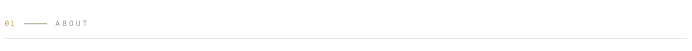
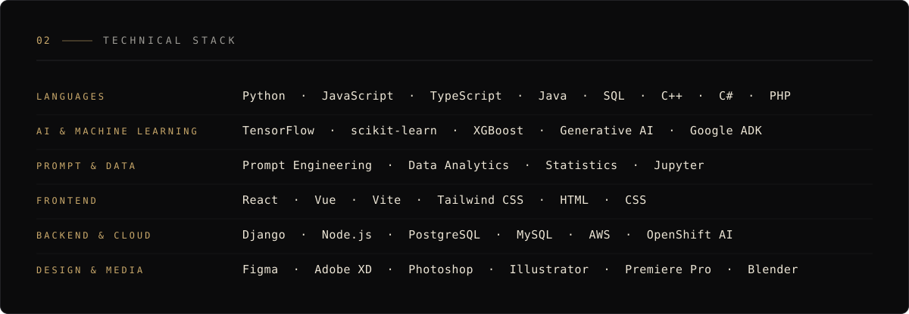
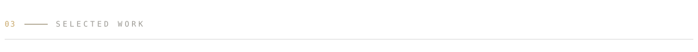
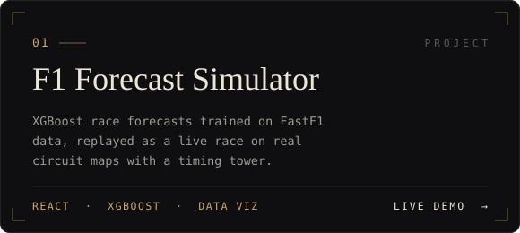
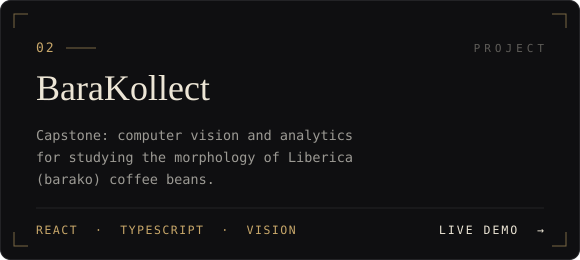
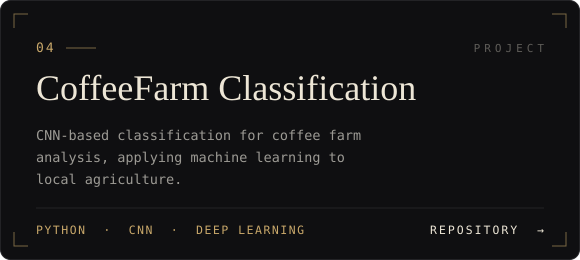
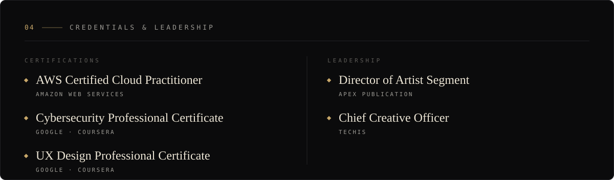

  

  
  
  
  
  

  

 

I'm **Carlos Yajie Fetizanan**, a developer who treats code as a canvas. I design and build **refined frontend experiences**, train **machine learning models** on real-world data, and am growing into a **full-stack engineer** who brings design and robust backend logic together.

Currently a college student specialising in **data analytics and machine learning**, based in the Philippines. My recent work spans race-outcome forecasting with XGBoost, computer vision for coffee bean analysis, and a portfolio built as a Renaissance painter's studio.

 

  

  
  

  
  

 

  

  
  

  

  <picture>
    <source media="(prefers-color-scheme: dark)" srcset="https://raw.githubusercontent.com/crlsyajie/crlsyajie/output/github-snake-dark.svg">
    <source media="(prefers-color-scheme: light)" srcset="https://raw.githubusercontent.com/crlsyajie/crlsyajie/output/github-snake.svg">
    
  </picture>

